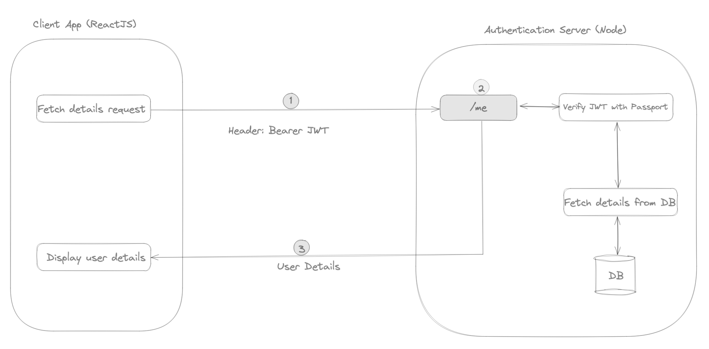

# Server

Authentication methods using traditional registration and login using username and password.

## Features

- Passport as the middleware for Node.js.
- MongoDB for storing user details.
- JWT for identifying the user request.
- Refresh tokens for renewing the JWT.

## Architecture

